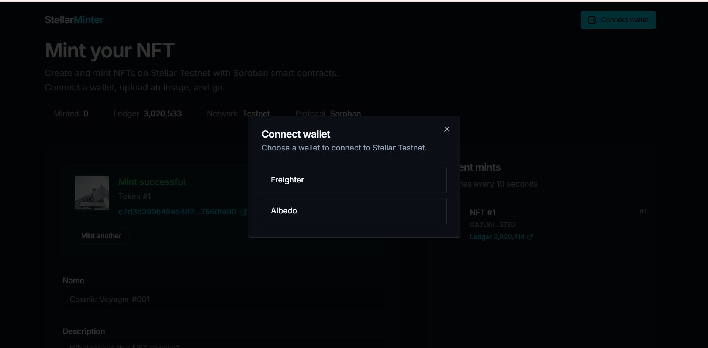
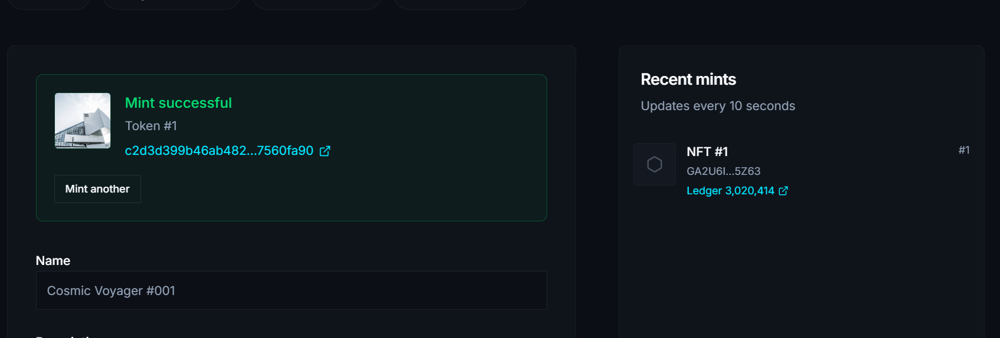

# Stellar NFT Minter

Multi-wallet NFT minting on **Stellar Testnet** using **Soroban** smart contracts and **StellarWalletsKit**.

**Live app:** https://stellar-nft-minter-rust.vercel.app

**GitHub:** https://github.com/rhapy01/stellar-nft-minter

**Testnet contract:** `CCR5FXO5HECHWEFFE4LOROEF6UOW4XWWKM6QKCSFBS72GJIXI2GMKO57`

## Screenshots (verified mint on testnet)

| App overview | Mint success + activity feed |
|---|---|
|  |  |

Example mint: **Cosmic Voyager #001** · Token **#1** · [View transaction on Stellar Expert](https://stellar.expert/explorer/testnet/tx/c2d3d399b46ab48234ee4d10b1931dd91ca831a5854a24bc6b2a8b9e7560fa90)

## Features

- **StellarWalletsKit** — Freighter + Albedo wallet integration
- **Soroban contract** — deploy, mint, read supply, listen to events
- **Real-time feed** — contract events polled every 10 seconds
- **Transaction status** — pending / success / fail UI with error handling
- **No backend** — pure static frontend talking to Stellar RPC

## Quick start

```bash
pnpm install
```

Create `artifacts/stellar-nft-minter/.env`:

```
VITE_CONTRACT_ADDRESS=CCR5FXO5HECHWEFFE4LOROEF6UOW4XWWKM6QKCSFBS72GJIXI2GMKO57
```

```bash
pnpm --filter @workspace/stellar-nft-minter run dev
```

## Deploy contract

```bash
cd contracts/nft && cargo build --target wasm32-unknown-unknown --release
pnpm --filter @workspace/scripts exec tsx src/deploy-contract.ts
```

## Deploy frontend (Vercel)

The repo includes `vercel.json` at the project root. Connect this repository in Vercel or run:

```bash
npx vercel deploy --prod
```

## Project structure

```
artifacts/stellar-nft-minter/   React + Vite frontend
contracts/nft/                  Soroban NFT contract (Rust)
scripts/src/deploy-contract.ts  Testnet deployment script
```

See [artifacts/stellar-nft-minter/README.md](artifacts/stellar-nft-minter/README.md) for full documentation.
